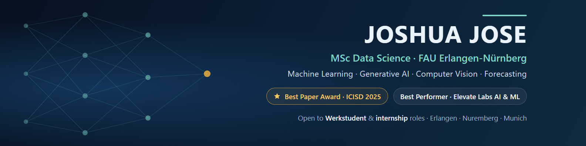

<!-- Layout built with GPRM-style widgets (gprm.itsvg.in): typing header, badges, tech-stack icons.
     Stats / streak / trophy cards are left out on purpose until the numbers flatter the profile. -->

  

  

  
  
  
  

---

### 👋 About me

MSc Data Science student at **FAU Erlangen-Nürnberg** (2026–2028). I build machine-learning and GenAI systems,
and I care about what it takes to *run* a model, not only to train it.

- 🏆 **Best Paper Award, ICISD 2025.** Team lead on *PrisonSecure*: real-time weapon detection (YOLOv11, **95.79% mAP@0.5**) and face recognition (FaceNet + SVM, **93.75% accuracy**). Published by Atlantis Press (Springer Nature) · [DOI](https://doi.org/10.2991/978-94-6463-866-0_82)
- 🥇 **Best Performer** of the Elevate Labs AI & ML internship cohort
- 🧾 Built **CareerCraft**, an LLM resume analyser on Google Gemini, shipped as a Streamlit app that is [live in production](https://resume-analyser-q098.onrender.com)
- ☁️ Cloud-operations background (VMware, automation, monitoring) · OCI 2025 Certified Data Science Professional
- 🔎 Open to **Werkstudent, internship and Master's-thesis** roles in ML / data science: Erlangen · Nuremberg · Munich, or remote within Germany
- 🗣️ English (full professional) · Hindi · Malayalam · German (A2, learning)

---

### 🧰 Tech stack

  

  
  
  
  
  
  
  
  
  
  
  

---

### 🚀 Featured projects

| Project | What it is | Stack |
|---|---|---|
| 🛡️ [**PrisonSecure**](https://github.com/j0shua-j0se/PrisonSecure) | Real-time prison surveillance: weapon detection + face recognition with audio alerts. **Best Paper, ICISD 2025** | YOLOv11 · FaceNet · SVM · OpenCV |
| 📈 [**quantforge**](https://github.com/j0shua-j0se/quantforge) | Execution-aware portfolio policy learning: walk-forward backtesting, CVaR risk metrics, experiment tracking | Python · MLflow · Docker |
| 🧠 [**ai-engineering-portfolio**](https://github.com/j0shua-j0se/ai-engineering-portfolio) | Build log: working through *AI Engineering from Scratch*, one runnable artifact per lesson | Python |
| 🩺 [**breast-cancer-logistic-regression**](https://github.com/j0shua-j0se/breast-cancer-logistic-regression) | Binary classifier with ROC / precision-recall analysis and threshold tuning: **ROC-AUC 0.996**, accuracy 0.96 | scikit-learn |
| 🧾 [**careercraft-ats-resume-analyzer**](https://github.com/j0shua-j0se/careercraft-ats-resume-analyzer) | LLM resume analyser: scores a PDF CV against a job description and returns match %, missing keywords and a profile summary. [Live app](https://resume-analyser-q098.onrender.com) | Gemini · Streamlit · PyPDF2 |
| 📦 [**walmart-sales-forecasting**](https://github.com/j0shua-j0se/walmart-sales-forecasting) | Weekly sales forecast for 45 stores with past-only lag features and a chronological split: XGBoost **R² 0.987**, MAE 17.9% below a naive baseline | XGBoost · pandas |
| 🧪 [**breast-cancer-svm**](https://github.com/j0shua-j0se/breast-cancer-svm) | Linear vs RBF SVMs tuned with GridSearchCV and stratified CV: test accuracy 0.974 | scikit-learn |

<b>📚 ML fundamentals (Elevate Labs internship)</b>

 

[data cleaning](https://github.com/j0shua-j0se/titanic-data-cleaning) ·
[EDA](https://github.com/j0shua-j0se/titanic-eda) ·
[linear regression](https://github.com/j0shua-j0se/housing-price-linear-regression) ·
[KNN](https://github.com/j0shua-j0se/iris-knn-classification) ·
[K-Means](https://github.com/j0shua-j0se/mall-customer-kmeans)

---

  <i>Let's talk about ML, data, or a Werkstudent role:</i> 
  <a href="https://www.linkedin.com/in/j0shuaj0se"><b>LinkedIn</b></a> · <a href="https://joshua-jose-portfolio.vercel.app"><b>Portfolio</b></a>

